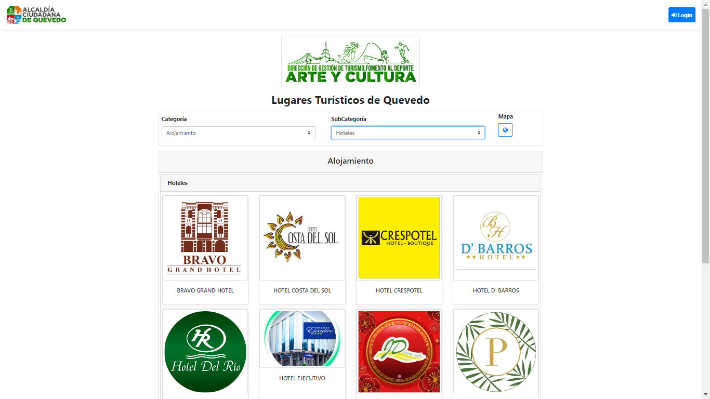
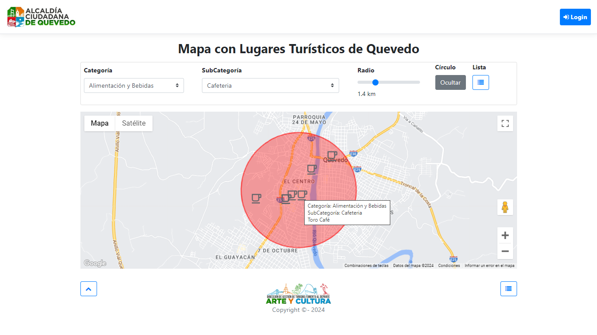
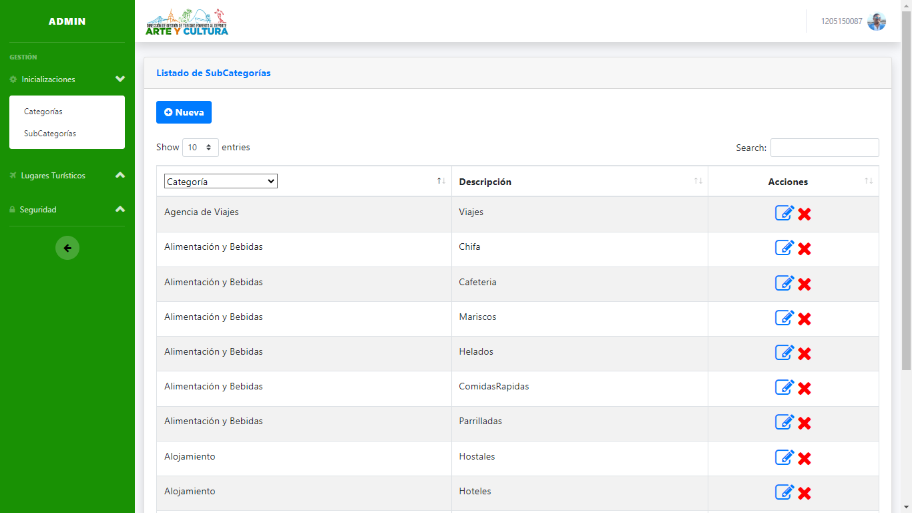
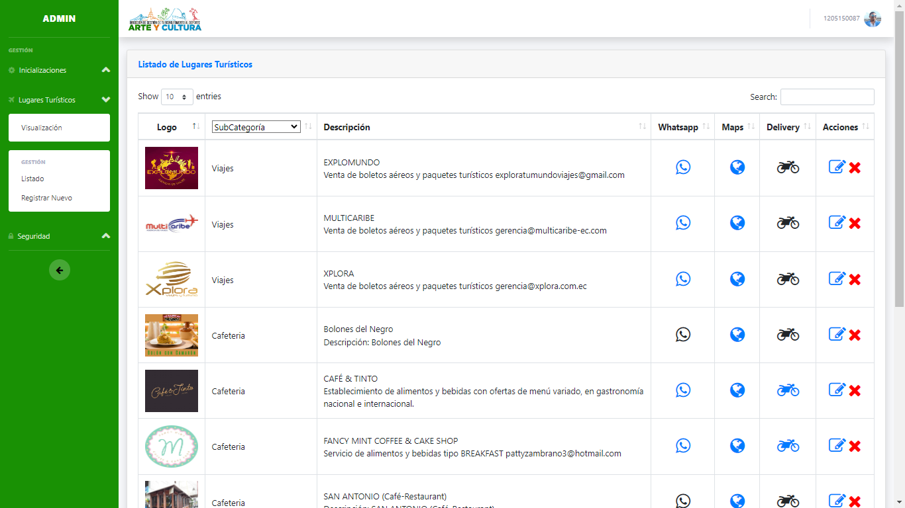
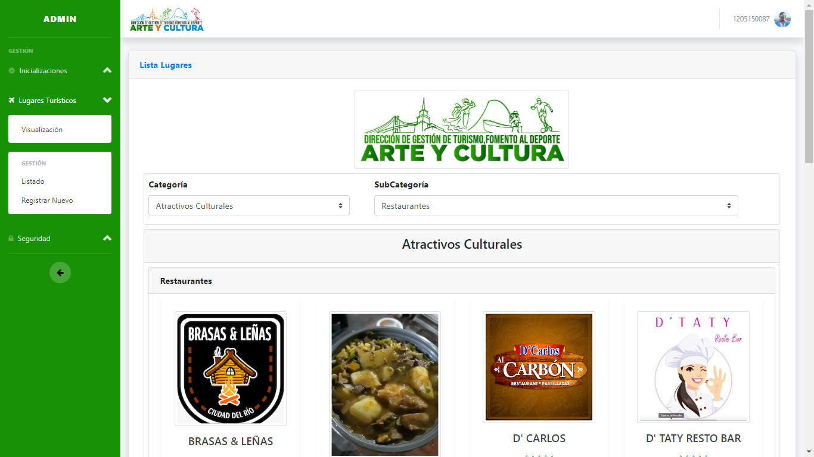
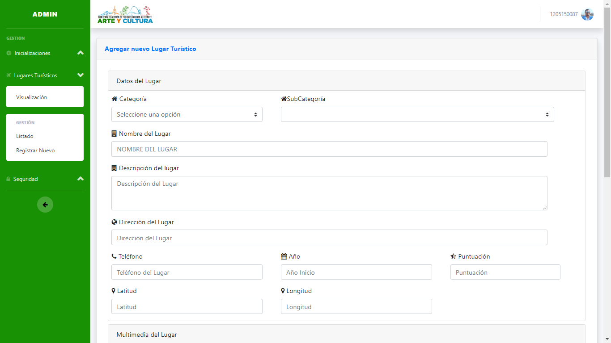

# Aplicación Web del Proyecto Turismo Quevedo

Este proyecto web, [Turismo Quevedo](https://turismoquevedo.com/), es una plataforma diseñada para ofrecer información detallada sobre los lugares turísticos de Quevedo. La plataforma incluye diversas categorías y subcategorías para facilitar la búsqueda de lugares de interés en la ciudad.

## Características del Sitio

- **Categorías y Subcategorías**: Los usuarios pueden explorar diferentes tipos de lugares turísticos organizados en categorías como Alojamiento, Alimentación y Bebidas, Arte y Cultura, entre otros.
- **Mapa Interactivo**: Un mapa interactivo permite a los usuarios localizar fácilmente los lugares turísticos dentro de Quevedo. El mapa muestra los puntos de interés en función de la categoría y subcategoría seleccionada, con un radio ajustable para personalizar la búsqueda.
- **Información Detallada**: Cada lugar turístico incluye una descripción detallada y, en muchos casos, una imagen representativa. Los usuarios pueden conocer más sobre hoteles, restaurantes, cafeterías y otros puntos de interés.
- **Diseño Intuitivo**: La interfaz del sitio es amigable y fácil de navegar, facilitando una experiencia de usuario agradable y eficiente.

## Capturas de Pantalla

## Versión Móvil

La aplicación móvil "Quevedo Turístico y Cultural" también está disponible en la Google Play Store. Esta versión permite a los usuarios acceder a toda la información desde sus dispositivos móviles, con una experiencia optimizada para pantallas pequeñas.

## URL del Sitio

El sitio web está disponible en [https://turismoquevedo.com/](https://turismoquevedo.com/).

## Contacto

Para más información o sugerencias, puedes contactarnos a través de [direccionturismogadquevedo@gmail.com](mailto:direccionturismogadquevedo@gmail.com).
